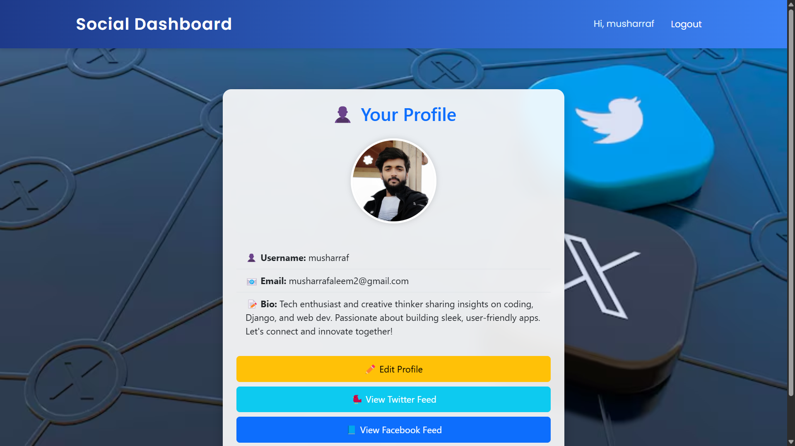
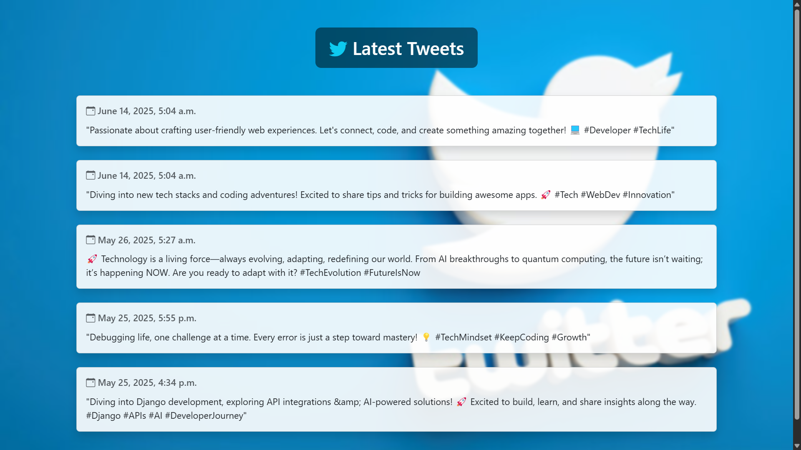

# Social Media Dashboard (Django)

An interactive dashboard to aggregate social media activity, built using Django. Currently integrated with Twitter API for real-time tweet retrieval, with plans to expand to Facebook and Instagram.

## ✨ Features

- **User Authentication** – Secure login and profile management with Django.
- **Twitter Integration** – Fetch and display users' tweets directly on the dashboard.
- **Responsive UI** – User-friendly interface for seamless navigation.
- **Scalability** – Designed to support future integrations with multiple platforms.

## 🛠 Tech Stack

- **Backend**: Django (Python)
- **Frontend**: HTML, CSS, JavaScript (Bootstrap for styling)
- **API**: Twitter API (v2) via `tweepy`
- **Database**: SQLite (Development) / MySQL (Planned for Production)
- **Others**: Git for version control

## Screenshots

Here are some previews of the dashboard:





## 🚀 Installation

1. Clone this repository:
   ```sh
   git clone https://github.com/Musharraf551/social_dashboard.git
